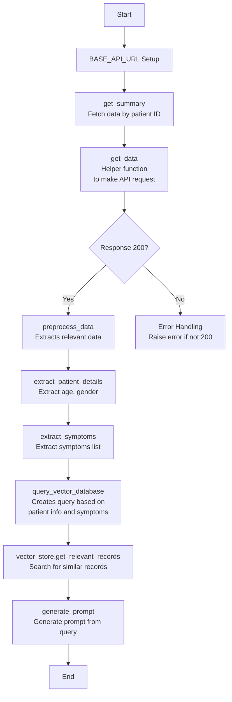

# MedScript
AI assitant for diagnosis

Group Members: 
[Aishwarya Suyamindra](https://github.com/aishwarya-suyamindra) ,[Girish Kumar Adari](https://github.com/agirishkumar), [Mallika Gaikwad](https://github.com/MallikaGaikwad), [Om Mali](https://github.com/maliom939) , [Pramatha Bhat](https://github.com/pramathabhat), [Rohan Reddy](https://github.com/tantalum-73)


**Demo recordings** 
1. https://northeastern.zoom.us/rec/share/HFf1d277uKP9Kb9_2tgWFIjVbV6hyUSevlLwpkQwsSH-DSDlK-plGogxDqBTx1EJ.wokUQnQATvARIg8_?startTime=1730857443000
Passcode: 5jm=N*#!

2. https://northeastern.zoom.us/rec/share/HFf1d277uKP9Kb9_2tgWFIjVbV6hyUSevlLwpkQwsSH-DSDlK-plGogxDqBTx1EJ.wokUQnQATvARIg8_?startTime=1730857682000
Passcode: 5jm=N*#!

### Setup Instructions
Please confirm that **Python >= 3.8** or a later version is present on your system prior to installation. This application is designed to be compatible with Windows, Linux, and macOS platforms.

### Step-by-Step Guide
Step 1: Clone the Repository on your Terminal
Clone the repository to the local machine and navigate into the project directory:

```bash
git repo clone agirishkumar/MedScript.git
cd MedScript
```
Step 2: Open the Project in Visual Studio Code
Open the project folder (MedScript) in Visual Studio Code.

**Step 3: Create and activate a virtual envionment 'MedEnv'**
```bash 
python3 -m venv MedEnv
```
To Activate the virtual environment
for Linux/Mac:
```bash
source MedEnv/bin/activate
```
for Windows:
```
MedEnv\Scripts\activate
```

**Step 4: Setup GCP on ubuntu terminal:**

- Add the Cloud SDK distribution URI as a package source
```bash
echo "deb [signed-by=/usr/share/keyrings/cloud.google.gpg] https://packages.cloud.google.com/apt cloud-sdk main" | sudo tee -a /etc/apt/sources.list.d/google-cloud-sdk.list
```

- Import the Google Cloud public key
```bash
curl https://packages.cloud.google.com/apt/doc/apt-key.gpg | sudo apt-key --keyring /usr/share/keyrings/cloud.google.gpg add -
```

- Update and install the Cloud SDK
```bash
sudo apt-get update && sudo apt-get install google-cloud-sdk
```

- initialize the SDK:
```bash
gcloud init
```

login with google account, select the project

- verify the configuration:
`gcloud config list`

**Step 5 :** Run the requirements.txt file to install all the required libraries 
```bash
pip install -r requirements.txt
```

**Step 6: Set up the .env file**
create a .env is main repo directory, refer to .env.example file for template.

**Step 7: Installing Docker**
- Ensure Docker is installed. To install, follow the instructions on [Docker website](https://docs.docker.com/engine/install/)

    ```bash
    docker --version
    docker-compose --version

**Step 8: Steps to try the app**
- change your directory to data_pipeline

``` cd data_pipeline ``

convert the initiate.sh file into executable and run it
```
 chmod +x initiate.sh```
```
```
./initiate.sh
```
this will setup the airflow, fastapi, setup the requirements for accessing gcloud and resources for RAG.
whenever this script is ran, it automatically removes the existing airflow containers, makes sure the ports are free

**Step 9: Accessing FastAPI & Airflow**

The Airflow UI will run on port `8080`. It can be accessed at `http://localhost:8080`. 

use username : admin, password: admin
to access the dashboard

The fastAPI UI will run on port `8000`. The API endpoints UI page can be accessed at `http://localhost:8000/docs`. 


### data_pipeline Folder structure

- **logs/**: Directory where logs for the Airflow tasks are stored.
- **dags/**: Contains files required for the workflow of the data pipeline.
  - **src/**: Directory has base.py file, which provides the helper functions to tasks.
  - **main.py**: Entry point for executing the data pipeline tasks.
  - other py files are related to RAG 
- **secrets/**: Contains Gcp keys
- **utils/**: Rag related utility files
- Docker-compose.yml file for building the containers required FAstApi and Airflow
- Dockerfile: Image thats used in the Docker compose file 

**MedScript Folder Structure**
 - data_pipeline: is already discussed above
 - app: Main backend application directory
      - api:  has the endpoints and dependencies code
      - core: has configuration and app logging code
      - db:  has crud , models, schemas defined in the respective folders
      - utils: has the authentication, http errors, middleware files
      - dockerfile: to run the backend in container
      - main.py: to run the backend
 - app-architecture-images: Contains diagrams of different functionality, workflow and components architecture
      - **DAG pipeline Image**
      - **DAG pipeline Gantt chart**
 -  tests:
      - unit: contains extensive unit tests for all the backend, db, Rag, Airflow 

**Run Unit Test**
```
pytest tests/unit/ --cov=app
```


Dataset that we used for RAG : URL: https://physionet.org/content/labelled-notes-hospital-course/1.1.0/

 License (for files):
PhysioNet Credentialed Health Data License 1.5.0

Data Use Agreement:
PhysioNet Credentialed Health Data Use Agreement 1.5.0

Required training:
CITI Data or Specimens Only Research 

-------------------------------------------------------------------------------

## Data Preprocessing

## MIMIC-4 Dataset Download and Upload to Google Cloud Storage Bucket

This script automates the process of downloading the MIMIC-4 dataset from PhysioNet and uploading it to a Google Cloud Storage (GCS) bucket. It includes error handling and logging features for streamlined data management. The script uses environment variables for secure access credentials.

## Data Preprocessing

This section processes clinical notes from the MIMIC-4 dataset to streamline structured data extraction, transformation, and analysis. We utilize Google Cloud Storage to store the preprocessed and transformed data, and each document section in the clinical notes is processed into meaningful, manageable chunks.

### Description

This pipeline preprocesses clinical notes from the MIMIC-4 dataset for machine learning applications. Key preprocessing tasks include:

- Cleaning and structuring clinical text data 
- Segmenting notes into predefined sections
- Replacing blanks, abbreviations, and placeholders
- Handling list formatting within the text
- Flattening nested data for storage
- Chunking large records into manageable JSON strings

### Steps in Preprocessing
#### 1. Download Dataset: 
- Load the dataset into memory using Python libraries (e.g., `pandas`, `csv`).
- Verify the data structure and check for missing or corrupt records.

#### 2. Text Segmentation: 
Clinical notes often contain multiple sections (e.g., patient history, diagnosis, medications). These sections should be properly segmented into smaller units for analysis.

Actions:

- Use sentence segmentation techniques to divide long clinical texts into sentences or paragraphs.
- Optionally, further divide by sections like “Patient History”, “Medications”, or “Diagnosis”.

#### 3. Data Flattening::

Sometimes, the data might have nested or hierarchical structures (e.g., multiple notes per patient or episode). Flattening simplifies the data by bringing everything into a consistent format.

Actions:

- Flatten the dataset such that each row corresponds to a single clinical note or text entry.
- This can be done by exploding nested columns or flattening JSON-like structures.

#### 4. Chunking Text:
Chunk long texts into manageable portions to avoid input size limitations in machine learning models.
Actions:

- Divide the text into smaller segments (chunks) based on the token count or paragraph length.
- Ensure that each chunk contains meaningful text and avoids cutting sentences in the middle.

#### 5. Removing Noise:
Remove irrelevant or noisy elements from the text to retain only useful data.

Actions:

- Remove non-text elements like headers, footers, or special characters.
- Eliminate any personal identifiers (e.g., patient names or ID numbers) using regex or a predefined list.


#### 8. Saving Preprocessed Data:
Save the preprocessed data in a structured format in csv


## Embedding Generator

`create_embedding.py` is a utility script designed to:
- Generate embeddings from text data (e.g., clinical notes) using a BERT model.
- Efficiently manage GPU memory for large-scale text data processing.
- Store the generated embeddings in Google Cloud Storage.

### Requirements
**Libraries**:
- `transformers` for the BERT model and tokenizer.
- `torch` for GPU-based tensor computations.
- `google-cloud-storage` for storing embeddings in GCS.
- `pandas`, `tqdm` for data handling and progress tracking.

## Qdrant Vector Database Integration

In this step we upload embedding vectors from a CSV file in Google Cloud Storage (GCS) to a Qdrant vector database. It handles downloading data from GCS, processing it in chunks, and uploading to Qdrant with retry logic for any failures.

### How It Works
1. Download Embedding Data: The script downloads a CSV file (embed_df_10k.csv) containing embeddings from Google Cloud Storage.

2. Setup Qdrant Collection: It checks if the specified collection exists in Qdrant and creates it if necessary.

3. Batch Processing: The embedding vectors are uploaded in batches (default chunk size: 100) to prevent memory overload and optimize performance.

4. Retry Logic: If uploading a batch fails, the script will automatically retry up to 3 times (with increasing delay between retries).

### Key Functions:

- **chunk_points**: Splits embedding points into smaller chunks for batch processing.
- **add_to_vectordb**: Uploads embeddings to Qdrant in batches with retry logic.
- **setup_qdrant_collection**: Ensures the Qdrant collection exists, creating it if not.
- **update_to_vectordb**: Main function to download data from GCS, process it, and upload to Qdrant.
- **get_qdrant_instance_ip**: Retrieves the IP address of the Qdrant instance on Google Cloud.


## Querying the Qdrant Vector Store

This step allows us to query a Qdrant vector database and retrieve the most relevant points to a given query. It uses a pre-trained transformer model ( PubMedBERT) to generate embeddings for the query and then searches for the most similar points in the Qdrant collection.

### How It Works
- **Query Embedding**: The query string is converted into a vector embedding using a pre-trained transformer model (PubMedBERT).
- **Search in Qdrant**: The generated embedding is used to search for the top `k` most similar vectors in the Qdrant collection. The search results are ranked based on similarity (cosine distance).
- **Display Results**: The top `k` results (default: 3) are returned, showing their IDs, similarity scores, and payload data.

The Data Pipeline is constructed like:


## Pipeline Orchestration (Airflow DAGs):

The Base.py file consists the code to interact with a FastAPI backend to fetch patient summary data and process it for further analysis. The explanation:

1. **Imports and Setup**:
   - The code imports necessary libraries: `requests` for making HTTP requests, `json` for handling JSON data, and `datetime` for date manipulations.
   - A base API URL is defined for accessing the FastAPI service.

2. **Function Definitions**:
   - `get_data(url: str)`: A helper function that takes a URL as input, makes a GET request to that URL, and returns the JSON response if the request is successful. If the request fails, it raises an exception.
   - `get_summary(patient_id: int)`: This function constructs a URL to fetch a patient's summary by their ID and calls `get_data()` to retrieve the data.
   - `preprocess_data(data: dict)`: This function processes the data returned from the API. It extracts patient details and symptoms, raising an exception if no data is provided.
   - `calculate_age(date_of_birth: str)`: A helper function that calculates the age of a patient based on their date of birth.
   - `extract_patient_details(patient: dict)`: Extracts and formats details about the patient, including age, gender, medical history, and allergies.
   - `extract_symptoms(visits: dict)`: Compiles a list of reported symptoms from the patient's visits, formatting them for display.
   - `query_vector_database(data: dict)`: Generates a query string using the processed patient information and symptoms, and retrieves relevant records from a vector store database.
   - `generate_prompt(query: str)`: This function is defined but not implemented in the code. Its purpose would be to generate a prompt based on the query, possibly for further processing or interaction.

3. **Error Handling**:
   - In several places, the code includes checks to raise exceptions if the data is not valid or empty, ensuring that the subsequent operations have the required information.

Overall, the script fetches patient data from an API, processes it to extract relevant information, and prepares a query for further analysis or storage in a vector database.
There is a flowchart to explain the concept in more detail



- The main.py orchestrates a sequence of tasks for processing patient data. 

**1. Imports:**
- The necessary modules and functions from Airflow and other libraries are imported, including DAG creation, Python tasks, email notifications, and triggering other DAGs.

**Default Arguments:**
- default_args specifies parameters for the DAG, including the number of retries and the delay between retries.

**DAG Definition:** 
The DAG is created with a unique identifier, description, and a start date.

**Tasks:**
Load Data Task: This task fetches the patient summary using the get_summary function for a specific patient ID.
Data Preprocessing Task: This task preprocesses the data retrieved from the previous task using the preprocess_data function.
Query Vector Database Task: This task queries the vector database for similarity searches using the processed data with the query_vector_database function.


## Git Workflow and Branching Strategy for the Project
__main Branch:__
- This branch is your production-ready branch.
- Only stable, tested, and production-ready code should be present here.
- Merges to main should only happen from dev after thorough testing and code review.

__dev Branch:__
- This branch is used for active development.
- All features, bug fixes, and enhancements are merged into dev.
- Once a feature or fix is complete, it’s merged back into dev via a pull request.

__Feature Branches:__
- Feature branches are created from the dev branch for any new feature, bug fix, or task.
- Naming convention: feature/\<task-name>, bugfix/\<task-name>, enhancement/\<task-name>.
__Examples:__
    feature/user-authentication
    bugfix/patient-age-validation
    enhancement/api-logging
Once the feature or fix is complete, a pull request is created to merge the feature branch into dev.


## Data Versioning (DVC):
- DVC (Data Version Control) to manage and version control our datasets throughout the preprocessing pipeline
- Raw data is loaded from Google Cloud Storage (GCS), processed and cleaned using our Airflow pipeline, and the preprocessed data is then stored back to


## Tests and Modules

The results of a test run for all the files in app/db. The testcases covers scenarios about creating patient details, updating it and deleting it. It also focuses on crud operations for all tables of doctor.py, patient.py, patient_details.py, patient_symptoms.py, patient_visits.py

**Test Results:**

* **Coverage:** The overall test coverage is 97%, which is a very good score and indicates a high degree of test coverage. 
151 tests were executed successfully.
149 passed and 2 kipped with 96% coverage


## Tracking and Logging
The logs file shows various operations related to patient details, doctor details and user login information, including fetching, creating, updating, and deleting patient and doctor records. There are several requests to the API, with status codes indicating successful (200, 201) and failed (404, 500) operations. Notable errors include an issue with inserting data due to a field value exceeding the character limit, and missing arguments in a function call.  Our pipeline is equipped with comprehensive logging to monitor progress and detect errors during data processing. We utilize Python’s logging library to create a custom logger that records key information at each step of the pipeline.

**Key Features:**
- **Progress Tracking**: Logs are generated at every stage, covering all functions in the pipeline.
- **Error Monitoring**: Errors are logged with detailed context, making issue identification and resolution quicker.
- **Custom Log Path**: All logs are stored in `MedScript/dev/logs/app.log` for easy access and troubleshooting.


## Pipeline Flow Optimization


The figure shows the Gantt chart from an Airflow DAG run, visualizing the execution timeline of tasks within the data_pipeline. It includes four tasks: load_data_task, data_preprocessing_task, query_vectorDB_task, and generate_prompt_task.

Each task's execution duration is represented by bars, with different segments indicating stages of the task's progress. load_data_task and data_preprocessing_task took the longest time to complete, while query_vectorDB_task and generate_prompt_task were shorter in duration. The pipeline appears to be running multiple iterations or instances, with several successful executions marked in green, showing consistent task completion across these runs.


The figure shows task dependency graph of an Airflow DAG 'data_pipeline'. The pipeline consists of four tasks, each represented by a box, arranged sequentially from left to right:

1. `load_data_task`
2. `data_preprocessing_task`
3. `query_vectorDB_task`
4. `generate_prompt_task`

Each task has a "success" status, indicated by the green outline and check mark. This setup implies that each task depends on the completion of the previous one, following a linear workflow. All tasks are implemented using the `PythonOperator`.


---

# Model Development Process

### Overview
- A pre-trained model, **`llama3-med42-8B`**, was selected from Google's Model Garden based on the experiments run locally and mlflow results.
- After validation, the **`llama3-med42-8B`** model is deployed to **Google Cloud Platform (GCP)**.
- An endpoint was created for the model using GCP's **Vertex AI** service to facilitate inference.

---
# Hyperparameter Tuning

## Overview
We conducted hyperparameter tuning using **grid search**, systematically exploring various combinations of key parameters to optimize the model's performance. A baseline configuration was defined, and variations were tested to identify the best-performing setup.
## Key Hyperparameters

| Parameter              | Description                                                   | Example Values   |
|------------------------|---------------------------------------------------------------|------------------|
| `min_tokens`           | Minimum number of tokens to generate                          | 512              |
| `max_tokens`           | Maximum number of tokens to generate                          | 1024             |
| `do_sample`            | Whether to use sampling during generation                     | `True`, `False`  |
| `temperature`          | Controls randomness during sampling                           | 0.7, 1.0, 1.2    |
| `top_k`                | Limits the sampling to top-k most probable tokens            | 50, 100          |
| `top_p`                | Controls nucleus sampling (probability mass)                  | 0.95, 0.99       |
| `repetition_penalty`   | Penalizes repeated token sequences to reduce redundancy      | 1.1, 1.3         |
| `length_penalty`       | Encourages longer or shorter sequences based on value        | 1.0, 1.2, 0.8    |

## Search Space and Tuning Process
### Baseline Configuration
```python
baseline = {
    "min_tokens": 512,
    "max_tokens": 1024,
    "do_sample": True,
    "temperature": 0.7,
    "top_k": 50,
    "top_p": 0.95,
    "repetition_penalty": 1.1,
    "length_penalty": 1.0
}
```
## Experiments

Using **grid search**, we tested the following configurations:

1. **Baseline**: Original configuration.
2. **Greedy Decoding**: `do_sample=False`, removed randomness.
3. **Temperature Variations**: Adjusted `temperature` to (0.5, 0.9, 1.2).
4. **Top-k/Top-p Variations**: Modified `top_k` to (10, 100) and `top_p` to (0.5, 0.99).
5. **Repetition/Length Penalties**: Adjusted `repetition_penalty` to (1.3) and `length_penalty` to (0.8, 1.2).
6. **Token Limits**: Modified `min_tokens`/`max_tokens` to (256, 512) and (1024, 2048).

### Tuning Process
We conducted hyperparameter tuning through experimentation:
1. **Baseline Configuration**: Started with a default setup and evaluated its performance.
2. **Parameter Adjustment**: Modified few parameter at a time while keeping others fixed based on grid search.
3. **Evaluation Metrics**: Each configuration was assessed based on:
   - **Inference Time**: Time taken for the model to generate results.
   - **Generated Token Count**: Number of tokens generated in each response.
   - **Model Initialization Time**: Time taken for the model to initialize.
   - **Result Word Count**: Total word count in the generated output.
   - **Quality of Results**: Judged by domain experts (doctors) for coherence and relevance.
4. **Selection**: The baseline configuration demonstrated optimal performance across these metrics and was selected for deployment.

---
# Experiment Tracking

## Experiment Setup

- **Model**: `Llama3-Med42-8B` from the Hugging Face Hub
- **Task**: Generate comprehensive diagnostic reports based on user input (patient data and symptoms).
- **Tracking Tool**: MLflow
- **Metrics Logged**:
  - Hyperparameters: `min_tokens`, `max_tokens`, `temperature`, `top_k`, `top_p`, `repetition_penalty`, `length_penalty`
  - Initialization time, Generated token count, estimated word count, and inference time.

## Experiment Flow
- The model is downloaded from the Hugging Face Hub and loaded using CPU offloading to manage memory efficiently.
- Each experiment's hyperparameters and model metrics are logged in MLflow.

## Results
Based on the graphs showing **Initialization Time**, **Generated Token Count**, **Estimated Word Count**, and **Inference Time**, along with feedback from domain experts (doctors) regarding the quality and relevance of results, the baseline configuration was selected for deployment.

### Visualizations


## MLflow Logs
- **Artifacts**: Full output and generated text files are saved for detailed review and troubleshooting.

---

## Model Sensitivity Analysis
### Hyperparameters Sensitivity Analysis Results

Based on our experiments, the following observations were made:

#### Key Findings
1. **Initialization Time**:
   - The baseline configuration minimized initialization time, showing stability across multiple runs.

2. **Generated Token Count**:
   - The baseline consistently produced an optimal token count for coherent and contextually rich outputs.

3. **Estimated Word Count**:
   - The word count remained balanced under the baseline configuration, ensuring concise yet comprehensive responses.

4. **Inference Time**:
   - The baseline achieved lower inference times compared to variations with higher temperatures or extreme `top_k` and `top_p` values.

5. **Expert Feedback**:
   - Doctors confirmed that the baseline produced the most contextually relevant and coherent responses among all configurations.

#### Final Decision
Considering the trade-offs in initialization time, token generation, inference time, and expert feedback, the **baseline configuration** was selected for deployment.

---

## Data Versioning and Transformation


gcp-storage: This remote points to the medscript-mimic4-dataset bucket, with credentials stored in ../data-pipeline/secrets/medscript-sa.json.

gcp-storage-records: This remote points to the dataset-records bucket, using the same credential file.

These configurations allow DVC to interact with these GCP buckets to store, retrieve, and version datasets or models. Data can be uploaded to the respective buckets and later versioned or accessed for different stages of the pipeline.


## Model Validation 

Our code implements a validation process for a medical diagnosis model within our healthcare application. It starts by downloading JSON data containing diagnosis records from Google Cloud Storage, which includes both true diagnoses and model predictions. The script then converts this data into a structured format using pandas, extracting primary and differential diagnoses for comparison. The core functionality lies in the get_validation_metrics function, which processes the data and calculates performance metrics using an external evaluation function. These metrics, which likely include measures such as accuracy and precision, are saved to a local file and returned for analysis. The main execution block sets up the necessary credentials, retrieves the diagnosis records, and runs the validation process, ultimately printing the evaluation scores. This validation step is crucial for assessing the model's accuracy and reliability in real-world medical diagnosis scenarios, helping to ensure the quality and effectiveness of the AI-assisted healthcare application.

## Model Evaluation

Our code is designed to assess how well generated text (e.g., translations or summaries) matches a set of reference texts using various evaluation metrics. Here's what it does:

1. **Calculates BLEU Score**: It uses the BLEU metric to compare how closely the words and phrases in the candidate text match the reference text, with an emphasis on n-grams (sequences of words). You can specify weights for different n-gram levels.

2. **Calculates ROUGE Scores**: It uses the ROUGE metric to compare overlapping words and sequences (e.g., unigrams, bigrams, longest common subsequence) between the reference and candidate texts.

3. **Calculates METEOR Score**: It evaluates text quality using precision, recall, and word alignment between the reference and candidate texts for a more nuanced similarity measure.

4. **Calculates Jaccard Similarity**: It computes how many unique words in the candidate and reference overlap, as a proportion of their combined total unique words.

5. **Combines Results**: The function `evaluate_metrics` consolidates the BLEU, ROUGE, METEOR, and Jaccard scores into a single dictionary, providing a comprehensive evaluation of the quality of the generated text.

The overall purpose is to provide a detailed, multi-metric analysis of how similar the generated text is to the reference text, enabling objective comparison and quality assessment.


## Model Bias Checking

## Overview
We preprocessesed data by categorizing demographics (age, BMI, and gender), condition complexity, and symptom severity to detect and analyze potential biases in the data and model performance. Metrics like the mean, standard deviation, count were computed for key performance indicators the results are visualized through scatter plots, box plots, and distributions to highlight discrepancies, enabling insights into fairness and areas for improvement.

## Results

### Gender bias

There is a slight difference in the means between females and males, with males having a higher average score. This suggests a potential gender bias favoring males in the semantic analysis. Males have slightly higher scores on average across all metrics (primary semantic, primary ROUGE-1, and difference in ROUGE-1), suggesting a potential gender bias favoring males. However, this difference is relatively small, and the t-test results (NaN) indicate that further statistical testing could not be conducted for significance.

### Age bias

For the age group 61-80, we see a positive mean score with a relatively high standard deviation, indicating variability in the primary semantic metric for this age group. Only the 61-80 age group has valid data, which limits the analysis for age bias. This could indicate either an imbalance in the dataset or insufficient sampling from other age groups. However, the available data for the 61-80 age group suggests some degree of bias in the primary semantic and ROUGE-1 metrics

### Complexity bias

We compare metrics like primary semantic, ROUGE-1, and difference in ROUGE-1 across two levels of condition complexity: Moderate and Simple. 
The analysis shows minor differences between the Moderate and Simple conditions across all metrics, with no significant evidence of bias or large disparities. While Moderate conditions slightly favor primary semantic, and Simple conditions show a slightly higher ROUGE-1 and diff_rouge1, these differences are minimal.

The Moderate condition has a slightly higher average semantic score, suggesting that the text in the moderate complexity condition may convey more meaning, or it could reflect the inherent difficulty of producing more complex content. However, the difference is small.  The difference in ROUGE-1 scores between the two conditions is again very small, with no significant bias or difference between Moderate and Simple complexity. The small variation between these two conditions suggests that complexity in the condition doesn't lead to drastic changes in performance according to these metrics.

### BMI analysis

The dataset is categorized based on BMI categories (Overweight, Normal, Underweight, Obese), and various metrics such as model agreement (mean and standard deviation), ROUGE-1 scores, and gender interaction are analyzed for each BMI category. 

The model agreement between the two categories (Normal and Overweight) is very similar, with both having mean values around 0.533, indicating that model agreement is consistent across these categories.
Underweight and Obese categories have no data, so they are excluded from this analysis.
Overweight individuals have a slightly higher ROUGE-1 score (0.249) than those in the Normal category (0.231), indicating that text generated for Overweight individuals might have slightly more overlap in terms of word choice or structure when compared to Normal individuals.
Underweight and Obese categories are missing data, making further comparison difficult.

Female individuals in the Normal BMI category have a higher model agreement (0.551) compared to Male individuals (0.525). This indicates potential gender-based differences in model performance or behavior, but these differences are slight.


This heatmap shows the correlation between demographic factors (like age and BMI) and various metrics (`primary_semantic`, `primary_sequence`, `primary_bleu`, `primary_rouge`, and their differences). Strong positive correlations are seen among `primary_rouge` metrics (e.g., `primary_rouge1` and `primary_rougeL`) and among `diff_rouge` metrics. `primary_semantic` moderately correlates with `primary_sequence` and `primary_rouge`. Age and BMI show negligible correlations with the other metrics, indicating minimal dependency on demographic factors.


The above boxplot shows interactions between age, BMI, condition complexity, and severity in relation to the `primary_semantic` metric. Older age groups and simpler conditions tend to have higher metric values, while BMI categories show overlapping trends with no major differences. Error bars highlight variability within groups.


The above boxplot presents three box plots illustrating the distribution of "primary semantic" scores across different demographic groups. The first plot shows a slight increase in the median score with age, with a wider range of scores in the younger age groups. The second plot reveals a clear decrease in the median score as BMI category increases, with a tighter distribution in the normal and overweight categories. Lastly, the third plot indicates a higher median score for males compared to females, and a slightly wider range of scores for males. Overall, the image suggests that age, BMI, and gender may be associated with differences in primary semantic scores.


The boxplot presents a series of box plots illustrating the distribution of "primary semantic" scores across various demographic and clinical factors. The plots reveal that symptom length and medical complexity show little to no effect on the scores, while duration, severity, age, and BMI category have a slight influence on the median score. The plot for gender shows a higher median score for males compared to females. Overall, the image suggests that some demographic and clinical factors may have subtle associations with primary semantic scores.


The table provides summary statistics for the variables "primary_semantic" and "bmi" across different severity levels. For each severity level (Moderate, Moderate to Severe, and Severe), we see the mean and standard deviation (std) of "primary_semantic" scores, as well as the count of observations (count) and the mean and standard deviation of BMI values. This table allows us to compare these metrics across different severity levels, potentially revealing patterns or associations between severity and these variables.


The table provides summary statistics for the variables "primary_semantic", "num_conditions", and "age" across different BMI categories. For each BMI category (Underweight, Normal, Overweight, and Obese), we see the mean and standard deviation (std) of "primary_semantic" scores, the mean and mean of "num_conditions" and "age", respectively, and the count of observations (count). Notably, the "Underweight" and "Obese" categories have no observations, resulting in NaN values for all metrics. This table allows us to compare these metrics across different BMI categories, potentially revealing patterns or associations between BMI and these variables.


The image presents a series of visualizations exploring the relationships between different variables. The top left plot shows the distribution of BMI across genders, revealing a higher prevalence of overweight and obese individuals among males. The top right plot displays the distribution of age and BMI, suggesting a potential association between increasing age and higher BMI. The bottom left plot illustrates the number of conditions by BMI category, indicating a higher number of conditions in the overweight and obese groups. The bottom right plot shows the distribution of severity classifications across BMI categories, with a higher proportion of moderate to severe cases in the overweight and obese groups. The middle left plot displays the mean performance metrics by BMI category, revealing a slight decrease in performance with increasing BMI. Finally, the middle right plot presents a heatmap of the correlation matrix, highlighting the relationships between different variables. Overall, the image suggests that BMI is associated with various health outcomes, including age, number of conditions, severity, and performance metrics.


The image presents a scatter plot illustrating the relationship between BMI and semantic agreement scores across different severity levels. The x-axis represents BMI values, while the y-axis represents semantic agreement scores. Each dot on the plot represents an individual observation, and the color of the dot indicates the severity level (blue for severe, orange for moderate to severe, and green for moderate). The plot shows that there is some variability in semantic agreement scores across BMI values within each severity level. However, there doesn't appear to be a clear trend or association between BMI and semantic agreement scores overall. 


The image presents a series of visualizations exploring the distribution of BMI categories and their relationships with model agreement and ROUGE-1 scores. The top left plot shows the distribution of BMI categories, with a clear dominance of the "Overweight" category. The top right plot displays the distribution of model agreement scores across BMI categories, revealing no significant differences between categories. The bottom left plot shows the distribution of ROUGE-1 scores across BMI categories, with a slight increase in the "Overweight" and "Obese" categories. The bottom right plot presents box plots illustrating the distribution of primary semantic scores across BMI categories, indicating a higher median score in the "Overweight" and "Obese" categories. Overall, the image suggests that BMI category may have a subtle influence on model agreement and ROUGE-1 scores, with the "Overweight" and "Obese" categories potentially showing slightly higher scores.


### Performance vs Symptom Length:
Shows how model performance (semantic similarity) varies with symptom description length:

Short: median ~0.80
Medium: median ~0.78
Long: median ~0.72
Very Long: median ~0.68
Interpretation: Model performs best with short symptom descriptions and performance decreases as length increases

### Performance vs Medical Complexity:
Shows model performance across different complexity levels:

Simple: median ~0.79
Moderate: median ~0.77
Interpretation: Model performs slightly better on simple cases compared to moderate complexity cases

### Performance vs Duration:
Shows performance across different symptom duration categories:

Acute: median ~0.80
Sub-acute: median ~0.78
Chronic: median ~0.73
Long term: median ~0.70
Interpretation: Model performs best on acute cases and performance decreases as symptom duration increases

### Performance vs Severity Level:
Shows performance across severity levels:

Severe: median ~0.75
Moderate: median ~0.80
Interpretation: Model performs better on moderate severity cases compared to severe cases

### Performance vs Age Group:
Shows performance across patient age groups:

0-18: median ~0.62
19-35: median ~0.65
36-50: median ~0.70
51-65: median ~0.75
65+: median ~0.78
Interpretation: Model performance increases with patient age, performing best on elderly patients

### Performance vs BMI Category:
Shows performance across patient BMI categories:

Underweight: median ~0.79
Normal: median ~0.77
Overweight: median ~0.73
Obese: median ~0.70
Interpretation: Model performs best on underweight patients and performance decreases as BMI increases

### Performance vs Gender:
Shows performance across patient gender:

Female: median ~0.77
Male: median ~0.75
Interpretation: Model performs slightly better on female patients compared to male patients

### Age and Severity Interaction:
Shows the interaction effect of age and severity level on performance:

For severe cases, performance is lower in younger age groups (0-18, 19-35)
For moderate cases, performance is more consistent across age groups
The gap between severe and moderate is largest in the 65+ age group
Interpretation: Severity has a bigger impact on performance for younger patients while elderly patients maintain better performance even for severe cases

### BMI and Severity Interaction:
Shows the interaction effect of BMI and severity level on performance:

For both severe and moderate cases, performance decreases as BMI increases
The gap between severe and moderate is largest in the obese BMI category
Interpretation: High BMI has a negative impact on performance, especially for severe cases. Maintaining a healthy weight may be important for the model to accurately assess the patient

### Age and Complexity Interaction:
Shows the interaction effect of patient age and medical complexity on performance:

    For simple cases, performance increases with age, with the highest performance in the 65+ age group
    For moderate cases, performance is more consistent across age groups, with a slight peak in the 36-50 age range
    For complex cases, performance peaks in the 19-35 age group and then decreases with older age Interpretation: The impact of medical complexity on performance varies by age group. Simple cases perform best in elderly patients, while complex cases are more challenging in older age groups.

### BMI and Complexity Interaction:
Shows the interaction effect of patient BMI and medical complexity on performance:

    For all complexity levels, performance generally decreases as BMI increases from underweight to obese
    The performance gap between complexity levels is largest in the underweight BMI category
    In the obese BMI category, performance is more similar across complexity levels Interpretation: High BMI has a negative impact on performance across all complexity levels. However, the effect of complexity is less pronounced in obese patients, suggesting that obesity itself may be a significant factor influencing performance.

### Correlation Matrix Interpretation:
Key Relationships:

    Age has a perfect positive correlation (1.0) with itself and a very weak negative correlation with BMI (-0.09)
    BMI has a perfect positive correlation (1.0) with itself
    Primary metrics:
    primary_semantic has moderate positive correlations with primary_sequence (0.67) and primary_rougeL (0.68)
    primary_sequence has a very strong positive correlation with primary_rougeL (0.83) and strong correlations with primary_rouge1 and primary_rouge2 (both 0.83)
    primary_bleu has weak positive correlations with other primary metrics (0.22-0.40)
    Differential metrics:
    diff_rouge metrics (L, 1, 2) have very strong positive correlations with each other (0.80-1.00)
    Weak positive correlations between primary and differential metrics (0.05-0.39)
    Demographic factors:
    Age has a very weak negative correlation with primary_semantic (-0.02)
    BMI has a very weak negative correlation with all primary metrics (-0.02 to -0.07)
    Both age and BMI have negligible correlations with differential metrics (-0.10 to 0.06) Interpretation: The correlation matrix shows the relationships between different metrics and demographic factors. Primary_sequence, primary_rougeL, and primary_rouge1/2 have strong positive correlations with each other, while primary_bleu is less correlated with other metrics. Age and BMI have minimal correlations with the performance metrics, suggesting they have limited direct impact. The strong correlations among diff_rouge metrics indicate they measure similar aspects of performance.


# Model Deployment

`chmod +x deploy.sh`
run `./deploy.sh` on terminal to configure and deploy your model and backend services on GCP. 

Refer `data_pipeline/deployment/README.md` for detailed step by step process.

For UI deployment please refer `UI/README.md`


---
