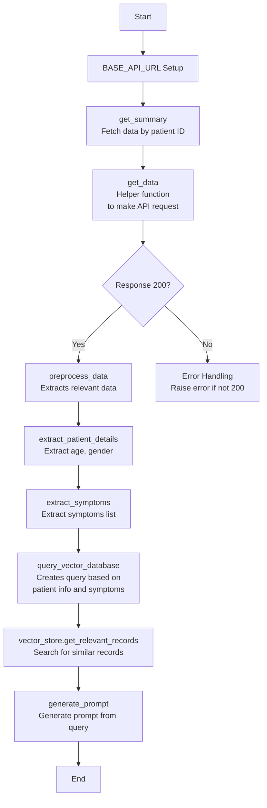
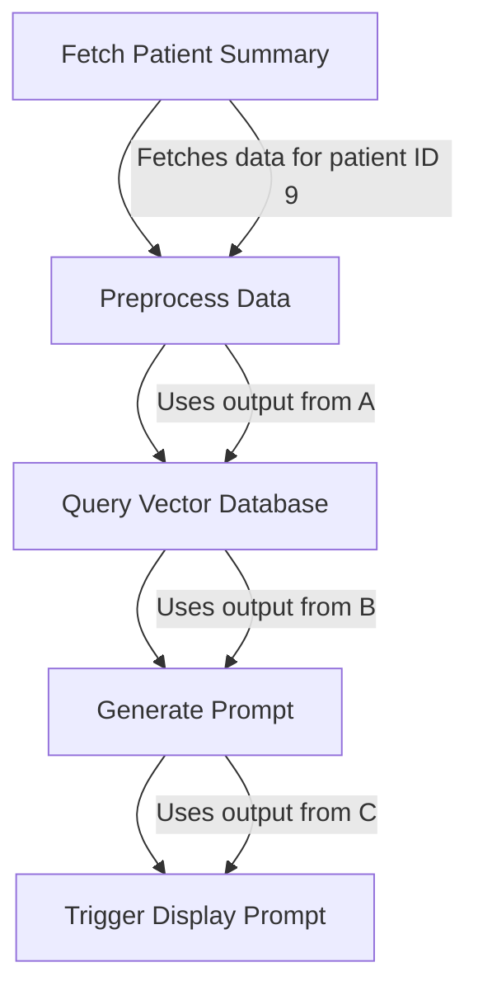

# MedScript
AI assitant for diagnosis

Group Members: 
[Aishwariya Suryamindra](https://github.com/aishwarya-suyamindra) ,[Girish Kumar Adari](https://github.com/agirishkumar), [Mallika Gaikwad](https://github.com/MallikaGaikwad), [Om Mali](https://github.com/maliom939) , [Pramatha Bhat](https://github.com/pramathabhat), [Rohan Reddy](https://github.com/tantalum-73)

### Setup Instructions
Please confirm that **Python >= 3.8** or a later version is present on your system prior to installation. This software is designed to be compatible with Windows, Linux, and macOS platforms.

### Step-by-Step Guide
Step 1: Clone the Repository on your Terminal
Clone the repository to the local machine and navigate into the project directory:

```bash
git repo clone agirishkumar/MedScript.git
cd MedScript
```
Step 2: Open the Project in Visual Studio Code
Open the project folder (MedScript) in Visual Studio Code.

**Step 3: Create and activate a virtual envionment 'MedEnv'**
```bash 
python3 -m venv MedEnv
```
To Activate the virtual environment
```bash
source MedEnv/bin/activate
```
**Step 4: Setup GCP on ubuntu terminal:**

- Add the Cloud SDK distribution URI as a package source
```bash
echo "deb [signed-by=/usr/share/keyrings/cloud.google.gpg] https://packages.cloud.google.com/apt cloud-sdk main" | sudo tee -a /etc/apt/sources.list.d/google-cloud-sdk.list
```

- Import the Google Cloud public key
```bash
curl https://packages.cloud.google.com/apt/doc/apt-key.gpg | sudo apt-key --keyring /usr/share/keyrings/cloud.google.gpg add -
```

- Update and install the Cloud SDK
```bash
sudo apt-get update && sudo apt-get install google-cloud-sdk
```

- initialize the SDK:
```bash
gcloud init
```

login with google account, select the project

- verify the configuration:
`gcloud config list`

**Step 5: Set up the .env file**
Save this file as .env in the repo

DB_USER=admin\
DB_PASS=admin\
DB_NAME=medscript\
DB_HOST=localhost\
DB_PORT=5434\
JWT_SECRET_KEY=myjwtsecretkey\
JWT_REFRESH_SECRET_KEY=myjwtrefreshsecretkey\
AIRFLOW_UID=123\
POSTGRES_USER=your_postgres_user\
POSTGRES_PASSWORD=your_postgres_password\
POSTGRES_DB=your_postgres_db\
AIRFLOW_WWW_USER_USERNAME=your_airflow_user\
AIRFLOW_WWW_USER_PASSWORD=your_airflow_user_password\
CLOUD_SQL_INSTANCE=your_cloud_sql_instance\
GOOGLE_APPLICATION_CREDENTIALS=/path/to/your/credentials.json

**Step 6 : Run the requirements.txt file to install all the required libraries 
```bash
pip install -r requirements.txt
```

**Step 7 : To run and check the app**
`python3 -m uvicorn app.main:app --reload`

- check the urls `http://127.0.0.1:8000`, `http://127.0.0.1:8000/api/v1/health`

**Step 8: Set up Airflow**

1. Initialize Airflow:
   ```bash
   docker compose up airflow-init
   ```
2. Start all containers:
   ```bash
   docker compose up
   ```
- Airflow orchestrates the execution of tasks in the pipeline by managing the scheduling and dependencies between various tasks defined in the DAGs. 

**To run the pipeline:**

- Navigate to the data-pipeline directory from the root folder

    ```bash
    cd data-pipeline
    ```

- Create a secrets folder to store the service account key

    ```bash
    mkdir secrets
    ```

- Copy the JSON service account key file into the secrets folder and rename it to service-account-key.json

    ```bash
    cp path/to/your/service-account-key.json secrets/
    ```

- Ensure Docker is installed. To install, follow the instructions on [Docker website](https://docs.docker.com/engine/install/)

    ```bash
    docker --version
    docker-compose --version
    ```
- Use Docker Compose to start the data pipeline

    ```bash
    docker-compose --env-file ../.env up
    ```
The Airflow UI will run on port `8080`. It can be accessed at `http://localhost:8080`. 

- To stop the data pipeline, run the following command:

    ```bash
    docker-compose --env-file ../.env down
    ```

### Folder structure

- **config/**: Contains configuration files for the pipeline, such as `airflow.cfg`, which defines settings for Apache Airflow.
- **logs/**: Directory where logs for the Airflow tasks are stored.
- **dags/**: Contains Directed Acyclic Graphs (DAGs) that define the workflow of the data pipeline.
  - **src/**: Directory for source files used in the DAGs.
    - **base.py**: Contains base classes or functions used across various tasks.
  - **main.py**: Entry point for executing the data pipeline tasks.
 
## Project Overview

This healthcare application project aims to enhance patient-doctor interactions by integrating AI into the medical workflow. Key features include:

The key factors for this healthcare application project are:

1. **Comprehensive Data Collection**: Ensuring standardized and detailed patient data is captured for accurate analysis and continuity in care.

2. **AI-Powered Disease Detection**: Utilizing advanced machine learning models to analyze patient data and identify potential diseases, increasing diagnostic speed and precision.

3. **Automated Prescription Generation**: Creating initial prescription suggestions based on AI-detected health conditions, which supports quicker treatment planning.

4. **Doctor Review and Oversight**: Providing doctors with a user-friendly interface to review, adjust, or override AI-generated prescriptions, maintaining medical expertise in the decision-making process.

5. **Enhanced Workflow Efficiency**: Streamlining the healthcare process by integrating AI tools, reducing time spent on data entry and initial diagnosis, allowing doctors to focus more on patient care.

6. **Educational Value for Medical Professionals**: Serving as a learning tool for doctors, as they can observe and evaluate AI-driven recommendations and adapt as needed.

These factors collectively improve patient outcomes, make healthcare workflows more efficient, and offer an educational advantage for medical professionals.


## Data Information

#### 1. For a General Diagnostic Model:
   
**Model: Med42
Data Card:**
- Type: Large Language Model
- Base: Llama-2
- Size: 70B parameters
- Specialization: Medical knowledge and reasoning
- Performance: 72% accuracy on USMLE sample exams
- License: Custom open-access license (requires acceptance)
- URL: https://huggingface.co/m42-health/med42-70b

**Dataset: MIMIC-III Clinical Database
Data Card:**
- Type: Clinical Database
- Size: >40,000 patient stays
- Format: CSV files
- Data types: Structured clinical data (demographics, vital signs, lab tests, medications,
etc.)
License: PhysioNet Credentialed Health Data License 1.5.0
URL: https://physionet.org/content/mimiciii/1.4/

/*Note: Data Rights and Privacy: De-identified data, requires completion of training course for access*/

#### 2. X-ray Diagosis Model:
   
**Model: CheXNet (open-source implementation)]
Data Card:**
- Type: Convolutional Neural Network
- Base: DenseNet-121
- Specialization: Chest X-ray analysis
- Performance: Exceeds radiologist performance on pneumonia detection
- License: MIT License
- URL: https://github.com/zoogzog/chexnet

**Dataset: ChestX-ray14
Data Card:**
- Type: Medical Imaging
- Size: 112,120 frontal-view chest X-ray images
- Format: PNG images
- Subjects: 30,805 unique patients
- Labels: 14 disease classes
- License: Open access for research
- URL: https://nihcc.app.box.com/v/ChestXray-NIHCC
  
/*Note: Data Rights and Privacy: De-identified data, free for research use*/

#### 3. ECG Diagnosis Model:

**Model: ECG-DenseNet (open-source implementation)
Data Card:**
- Type: Convolutional Neural Network
- Base: DenseNet
- Specialization: ECG interpretation
- License: MIT License
- URL: https://github.com/helme/ecg_ptbxl_benchmarking

**Dataset: PTB-XL ECG Dataset
Data Card:**
- Type: ECG Recordings
- Size: 21,837 ECG records
- Format: WFDB format
- Subjects: 18,885 patients
- Labels: 71 different ECG statements
- License: Open access
- URL: https://physionet.org/content/ptb-xl/1.0.1/

/*Note: Data Rights and Privacy: De-identified data, free for research use*/


#### 4. RAG Implementation Dataset:
**Dataset: PubMed Central Open Access Subset
Data Card:**
- Type: Biomedical Literature
- Size: Millions of full-text articles
- Format: XML and plain text
- Content: Peer-reviewed biomedical literature
- License: Open Access
- URL: https://www.ncbi.nlm.nih.gov/pmc/tools/openftlist/

/*Note: Data Rights and Privacy: Open access, no restrictions on use*/

## Data Schema
There are 8 tables. The ER Diagram is :


## Data Preprocessing

## MIMIC-4 Dataset Download and Upload to Google Cloud Storage Bucket

This script automates the process of downloading the MIMIC-4 dataset from PhysioNet and uploading it to a Google Cloud Storage (GCS) bucket. It includes error handling and logging features for streamlined data management. The script uses environment variables for secure access credentials.

### Setup
1. Install the required dependencies:

```python
pip install -r requirements.txt` 
```

2. Set Up Environment Variables: Create a .env file in the root directory with the following variables:

```
WGET_USERNAME=<your-physionet-username>
WGET_PASSWORD=<your-physionet-password>
```

### Description
This script performs the following tasks:

1. **Download Dataset**: The `download_dataset()` function uses `wget` to download the dataset from PhysioNet using a username and password provided in environment variables. If the download is successful, the function will print a success message.
2. **Upload to GCS Bucket**: The `upload_to_bucket()` function uploads the dataset to a specified GCS bucket using the `google-cloud-storage` library. After the file is uploaded, it is removed from the local filesystem to save space.

## Data Preprocessing

This section processes clinical notes from the MIMIC-4 dataset to streamline structured data extraction, transformation, and analysis. We utilize Google Cloud Storage to store the preprocessed and transformed data, and each document section in the clinical notes is processed into meaningful, manageable chunks.

### Desscription

This pipeline preprocesses clinical notes from the MIMIC-4 dataset for machine learning applications. Key preprocessing tasks include:

- Cleaning and structuring clinical text data 
- Segmenting notes into predefined sections
- Replacing blanks, abbreviations, and placeholders
- Handling list formatting within the text
- Flattening nested data for storage
- Chunking large records into manageable JSON strings

### Steps in Preprocessing
#### 1. Download Dataset: 
- Load the dataset into memory using Python libraries (e.g., `pandas`, `csv`).
- Verify the data structure and check for missing or corrupt records.

#### 2. Text Segmentation: 
Clinical notes often contain multiple sections (e.g., patient history, diagnosis, medications). These sections should be properly segmented into smaller units for analysis.

Actions:

- Use sentence segmentation techniques to divide long clinical texts into sentences or paragraphs.
- Optionally, further divide by sections like “Patient History”, “Medications”, or “Diagnosis”.

#### 3. Data Flattening::

Sometimes, the data might have nested or hierarchical structures (e.g., multiple notes per patient or episode). Flattening simplifies the data by bringing everything into a consistent format.

Actions:

- Flatten the dataset such that each row corresponds to a single clinical note or text entry.
- This can be done by exploding nested columns or flattening JSON-like structures.

#### 4. Chunking Text:
Chunk long texts into manageable portions to avoid input size limitations in machine learning models.
Actions:

- Divide the text into smaller segments (chunks) based on the token count or paragraph length.
- Ensure that each chunk contains meaningful text and avoids cutting sentences in the middle.

#### 5. Removing Noise:
Remove irrelevant or noisy elements from the text to retain only useful data.

Actions:

- Remove non-text elements like headers, footers, or special characters.
- Eliminate any personal identifiers (e.g., patient names or ID numbers) using regex or a predefined list.

#### 6. Stop Word Removal:
Stop words are common words (e.g., "the", "is", "and") that do not carry significant meaning for many NLP tasks. Removing them reduces the dimensionality of the text data.

Actions:

- Use predefined stop word lists from libraries nltk and spaCy.
- Remove these stop words from the tokenized text.

#### 7. Lemmatization:
Convert words into their base form to treat different forms of the same word as the same entity.

Actions:

- Use a lemmatizer (nltk and spaCy) to reduce tokens to their lemma.

#### 8. Saving Preprocessed Data:
Save the preprocessed data in a structured format, such as CSV, JSON, or database, for future use.

Actions:

- Convert the processed text back to a tabular format (e.g., Pandas DataFrame).
- Save the cleaned data to a desired storage format.

## Embedding Generator

`create_embedding.py` is a utility script designed to:
- Generate embeddings from text data (e.g., clinical notes) using a BERT model.
- Efficiently manage GPU memory for large-scale text data processing.
- Store the generated embeddings in Google Cloud Storage.

### Requirements
**Libraries**:
- `transformers` for the BERT model and tokenizer.
- `torch` for GPU-based tensor computations.
- `google-cloud-storage` for storing embeddings in GCS.
- `pandas`, `tqdm`, and `pickle` for data handling and progress tracking.

### Key Functions

1. `get_embedding(text, tokenizer, model, device)`

   Generates an embedding for a single text entry.
   
   - Parameters:
      - `text` (str): The input text to embed.
      - `tokenizer` (BertTokenizer): Tokenizer for BERT.
      - `model` (BertModel): BERT model for embedding generation.
      - `device` (torch.device): Device to run computations on (GPU or CPU).
   - Returns:
     - `Tensor`: The embedding vector for the input text.
     

2. `embed_and_save_to_gcp(input_csv, bucket_name)`
   
   Reads clinical notes from a CSV, generates embeddings, and saves them to Google Cloud Storage.

   - Parameters:
   
     - `input_csv` (str): Path to the CSV file containing clinical notes.
     - `bucket_name` (str): Name of the GCS bucket where embeddings will be saved.
   - Functionality:
     - Processes each note in the CSV, generates embeddings, and saves them as pickle files in GCS.

## Qdrant Vector Database Integration

In this step we upload embedding vectors from a CSV file in Google Cloud Storage (GCS) to a Qdrant vector database. It handles downloading data from GCS, processing it in chunks, and uploading to Qdrant with retry logic for any failures.

### How It Works
1. Download Embedding Data: The script downloads a CSV file (embed_df_10k.csv) containing embeddings from Google Cloud Storage.

2. Setup Qdrant Collection: It checks if the specified collection exists in Qdrant and creates it if necessary.

3. Batch Processing: The embedding vectors are uploaded in batches (default size: 100) to prevent memory overload and optimize performance.

4. Retry Logic: If uploading a batch fails, the script will automatically retry up to 3 times (with increasing delay between retries).

### Key Functions:

- **chunk_points**: Splits embedding points into smaller chunks for batch processing.
- **add_to_vectordb**: Uploads embeddings to Qdrant in batches with retry logic.
- **setup_qdrant_collection**: Ensures the Qdrant collection exists, creating it if not.
- **update_to_vectordb**: Main function to download data from GCS, process it, and upload to Qdrant.
- **get_qdrant_instance_ip**: Retrieves the IP address of the Qdrant instance on Google Cloud.


## Querying the Qdrant Vector Store

This step allows us to query a Qdrant vector database and retrieve the most relevant points to a given query. It uses a pre-trained transformer model (like PubMedBERT) to generate embeddings for the query and then searches for the most similar points in the Qdrant collection.

### How It Works
- **Query Embedding**: The query string is converted into a vector embedding using a pre-trained transformer model (e.g., PubMedBERT).
- **Search in Qdrant**: The generated embedding is used to search for the top `k` most similar vectors in the Qdrant collection. The search results are ranked based on similarity (cosine distance).
- **Display Results**: The top `k` results (default: 5) are returned, showing their IDs, similarity scores, and payload data.

The Data Pipeline is constructed like:


## Pipeline Orchestration (Airflow DAGs):

The Base.py file consists the code to interact with a FastAPI backend to fetch patient summary data and process it for further analysis. The explanation:

1. **Imports and Setup**:
   - The code imports necessary libraries: `requests` for making HTTP requests, `json` for handling JSON data, and `datetime` for date manipulations.
   - A base API URL is defined for accessing the FastAPI service.

2. **Function Definitions**:
   - `get_data(url: str)`: A helper function that takes a URL as input, makes a GET request to that URL, and returns the JSON response if the request is successful. If the request fails, it raises an exception.
   - `get_summary(patient_id: int)`: This function constructs a URL to fetch a patient's summary by their ID and calls `get_data()` to retrieve the data.
   - `preprocess_data(data: dict)`: This function processes the data returned from the API. It extracts patient details and symptoms, raising an exception if no data is provided.
   - `calculate_age(date_of_birth: str)`: A helper function that calculates the age of a patient based on their date of birth.
   - `extract_patient_details(patient: dict)`: Extracts and formats details about the patient, including age, gender, medical history, and allergies.
   - `extract_symptoms(visits: dict)`: Compiles a list of reported symptoms from the patient's visits, formatting them for display.
   - `query_vector_database(data: dict)`: Generates a query string using the processed patient information and symptoms, and retrieves relevant records from a vector store database.
   - `generate_prompt(query: str)`: This function is defined but not implemented in the code. Its purpose would be to generate a prompt based on the query, possibly for further processing or interaction.

3. **Error Handling**:
   - In several places, the code includes checks to raise exceptions if the data is not valid or empty, ensuring that the subsequent operations have the required information.

Overall, the script fetches patient data from an API, processes it to extract relevant information, and prepares a query for further analysis or storage in a vector database.
There is a flowchart to explain the concept in more detail



- The main.py orchestrates a sequence of tasks for processing patient data. 

**1. Imports:**
- The necessary modules and functions from Airflow and other libraries are imported, including DAG creation, Python tasks, email notifications, and triggering other DAGs.

**Default Arguments:**
- default_args specifies parameters for the DAG, including the number of retries and the delay between retries.

**DAG Definition:** 
The DAG is created with a unique identifier, description, and a start date.

**Tasks:**
Load Data Task: This task fetches the patient summary using the get_summary function for a specific patient ID.
Data Preprocessing Task: This task preprocesses the data retrieved from the previous task using the preprocess_data function.
Query Vector Database Task: This task queries the vector database for similarity searches using the processed data with the query_vector_database function.
There are placeholders for a prompt generation task and a trigger task, but they are commented out.
Task Dependencies: The tasks are linked together, ensuring that data_preprocessing_task runs after load_data_task, and query_vector_database_task runs after data_preprocessing_task.

Overall, the code sets up a data processing pipeline in Airflow that fetches, preprocesses, and queries patient data in a structured manner.

The main process is summarized



## Modules and Their Roles:

__main.py:__
 - The entry point of the application.
- Sets up the FastAPI instance, adds middleware, and includes routers for endpoints.
- Initializes the database and starts the server using Uvicorn.

__config.py:__
- Holds the configuration settings for the app, such as project metadata and database credentials.
- Reads from an environment file (.env), which is useful for securely managing sensitive information like database connection strings.

__patients.py (API Endpoints):__
- Defines the endpoints for interacting with patient records.
- Contains endpoints like:
    - POST /api/v1/patients/: Create a new patient.
    - GET /api/v1/patients/: Get a list of patients.
    - GET /api/v1/patients/{patient_id}: Get a specific patient by ID.

__models/patient.py:__
- Defines the SQLAlchemy model for the Patient table, including columns 
- for id, name, age, email, and timestamps.~

__schemas/patient.py:__
- Provides Pydantic schemas for data validation and serialization when working with patient data.
- Contains models for PatientBase, PatientCreate, PatientUpdate, and Patient.

__crud/patient.py:__
- Contains the CRUD operations for interacting with the database using SQLAlchemy’s ORM. This includes functions like:
    - get_patient(): Retrieve a patient by ID.
    - get_patients(): Retrieve multiple patients with pagination support.
    - create_patient(): Add a new patient to the database.
    - update_patient(): Update an existing patient’s data.
    - delete_patient(): Remove a patient from the database.

**Database Connection (session.py):**
- Establishes a connection to the PostgreSQL database using SQLAlchemy’s create_engine.
- Provides a SessionLocal class to manage database sessions.

__Logging (logging.py):__
- Sets up a logger that logs application activities to both the console and a file.
- Uses a rotating file handler to manage logs and avoid excessive log size.

__Middleware (middleware.py):__
- RequestIDMiddleware: Adds a unique request ID to each incoming request for traceability.
- LoggingMiddleware: Logs request details such as method, path, status code, and processing time.

## Git Workflow and Branching Strategy for the Project
__main Branch:__
- This branch is your production-ready branch.
- Only stable, tested, and production-ready code should be present here.
- Merges to main should only happen from dev after thorough testing and code review.

__dev Branch:__
- This branch is used for active development.
- All features, bug fixes, and enhancements are merged into dev.
- Once a feature or fix is complete, it’s merged back into dev via a pull request.

__Feature Branches:__
- Feature branches are created from the dev branch for any new feature, bug fix, or task.
- Naming convention: feature/\<task-name>, bugfix/\<task-name>, enhancement/\<task-name>.
__Examples:__
    feature/user-authentication
    bugfix/patient-age-validation
    enhancement/api-logging
Once the feature or fix is complete, a pull request is created to merge the feature branch into dev.


## Data Versioning (DVC):
- DVC (Data Version Control) to manage and version control our datasets throughout the preprocessing pipeline
- Raw data is loaded from Google Cloud Storage (GCS), processed and cleaned using our Airflow pipeline, and the preprocessed data is then stored back to


## Tests and Modules


## Tracking and Logging
The logs file shows various operations related to patient details, doctor details and user login information, including fetching, creating, updating, and deleting patient and doctor records. There are several requests to the API, with status codes indicating successful (200, 201) and failed (404, 500) operations. Notable errors include an issue with inserting data due to a field value exceeding the character limit, and missing arguments in a function call.  Our pipeline is equipped with comprehensive logging to monitor progress and detect errors during data processing. We utilize Python’s logging library to create a custom logger that records key information at each step of the pipeline.

**Key Features:**
- **Progress Tracking**: Logs are generated at every stage, covering all functions in the pipeline.
- **Error Monitoring**: Errors are logged with detailed context, making issue identification and resolution quicker.
- **Custom Log Path**: All logs are stored in `logs/application_logs/preprocessing_log.txt` for easy access and troubleshooting.


